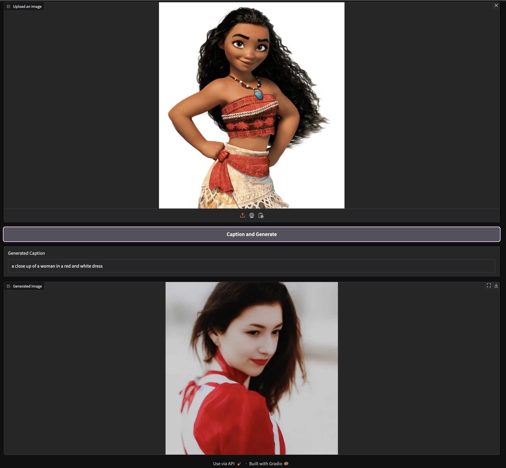

# GenAIGameOnGradio

## Description
GenAI Game on Gradio involves two key steps:
1. Implement the game described in the "Describe and Generate Game."
2. Integrate the result of Step 1 by also providing audio output as an optional requirement.

## Installation Instructions

### 1. Clone the Repository
Open your terminal and run the following command to clone the repository:
```bash
git clone https://github.com/YinYinPhyo/GenAIGameOnGradio.git
```
### 2. Install Required Packages
Navigate to the project directory and install the required packages using pip:

```bash
cd GenAIGameOnGradio
pip install -r requirements.txt
```
### 3. Configure Environment Variables
Create a .env file in the root directory of the project with the following content:

```bash
HF_API_KEY=your_huggingface_api_key
HF_API_TTI_BASE=your_text_to_image_api_endpoint # Image-to-text (captioning)
HF_API_ITT_BASE=your_image_to_text_api_endpoint # Text-to-image (generation)
```
Make sure to replace your_huggingface_api_key, your_text_to_image_api_endpoint, and your_image_to_text_api_endpoint with your actual API credentials and endpoints.

Add .env file as a .gitignore file.

### 4. Run the Application
Finally, run the application with the following command:

```bash
python3 app.py
```
## Usage
Once the application is running, you can access it via your web browser and start interacting with the AI models.

